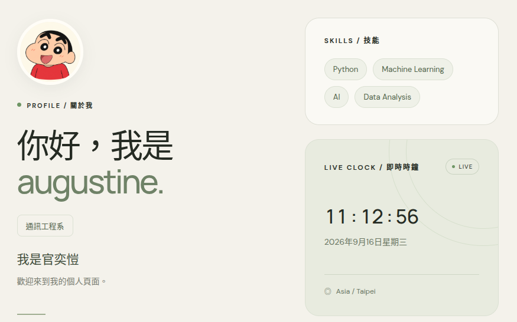

# augustine 的個人頁面

你好，我是官奕愷（augustine），就讀通訊工程系。歡迎來到我的個人網站！這裡整理了我的個人介紹與技能，並搭配蠟筆小新頭像，呈現簡單、親切的個人風格。

## 網站預覽

## 網站功能

- **個人介紹**：姓名、科系、自我介紹與蠟筆小新頭像。
- **技能列表**：Python、Machine Learning、AI、Data Analysis。
- **即時時鐘**：使用 JavaScript 顯示 `HH : MM : SS`，每秒自動更新，並顯示日期與瀏覽器所在時區。
- **響應式排版**：依螢幕寬度調整版面，適合電腦與手機瀏覽。

## 使用技術

使用 HTML 建立頁面內容、CSS 設計米白與綠色的版面，以及 JavaScript 更新時間；不需要安裝套件或建置工具。

## 檔案說明

| 檔案 | 用途 |
| --- | --- |
| `index.html` | 個人介紹、技能與時鐘的頁面結構 |
| `style.css` | 顏色、字型、卡片與響應式排版 |
| `app.js` | 即時時鐘、日期與時區顯示 |
| `assets/shinchan-avatar.png` | 蠟筆小新頭像 |
| `assets/personal-page-screenshot.png` | README 使用的網站截圖 |

## 如何瀏覽

下載或複製此儲存庫，保留原本的資料夾結構，再用瀏覽器開啟 `index.html` 即可。Google Fonts 需要網路連線；無法載入時會使用備用字型。

截圖中的時間是拍攝當下的畫面，實際開啟網站後，時鐘會持續更新。
